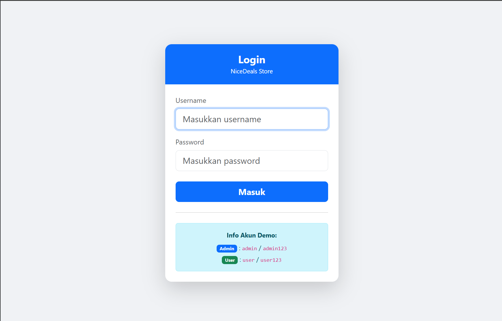
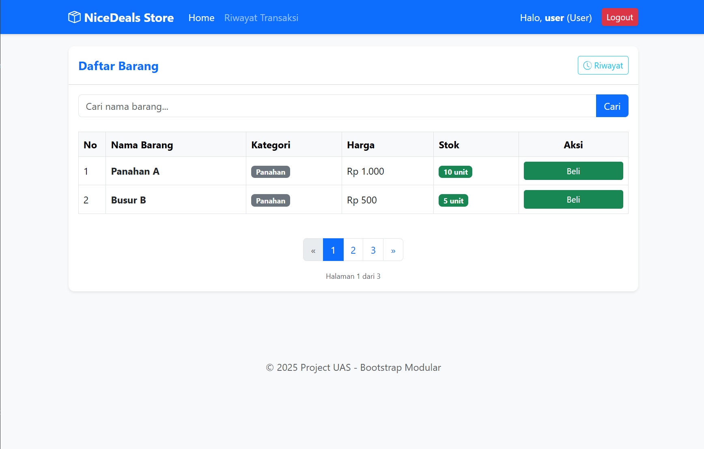
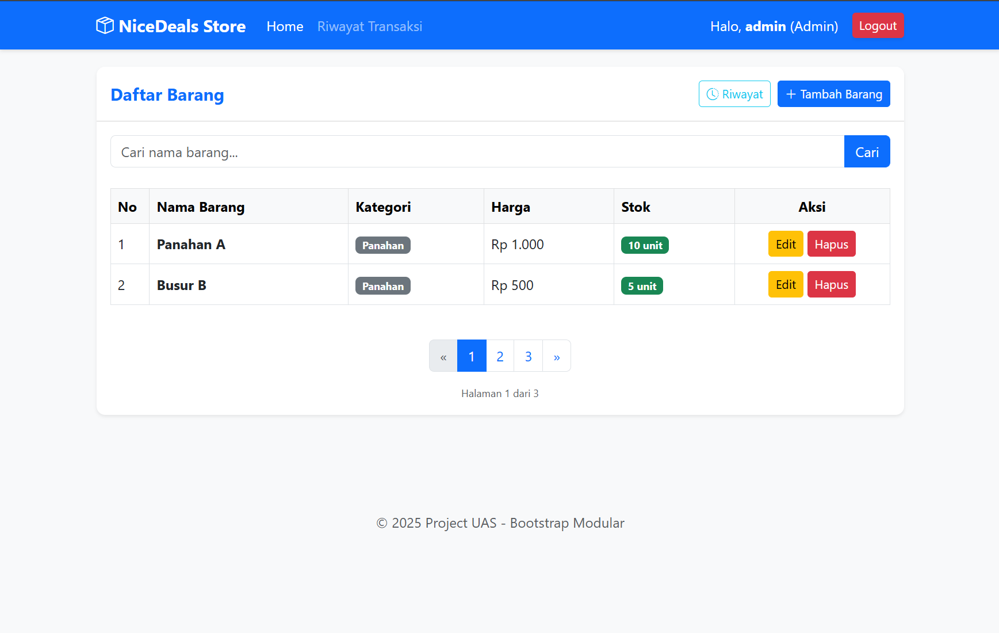
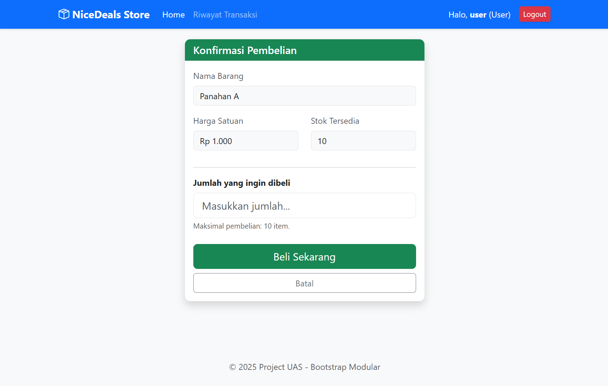
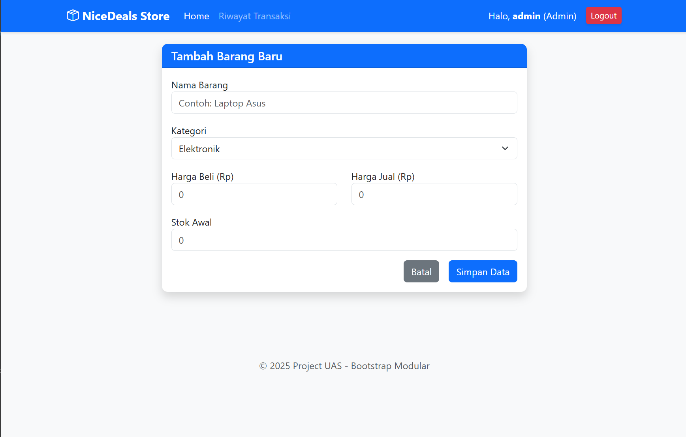
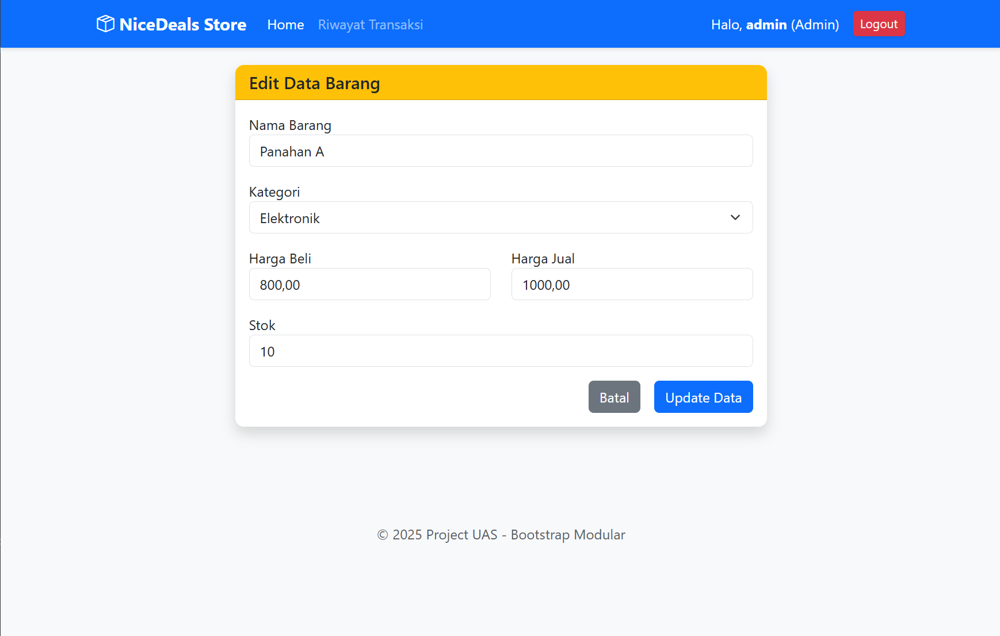
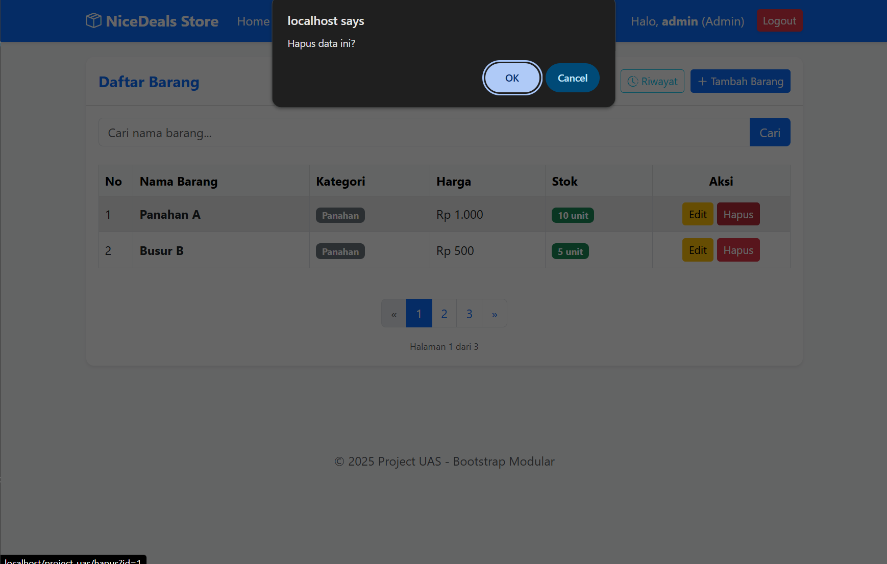
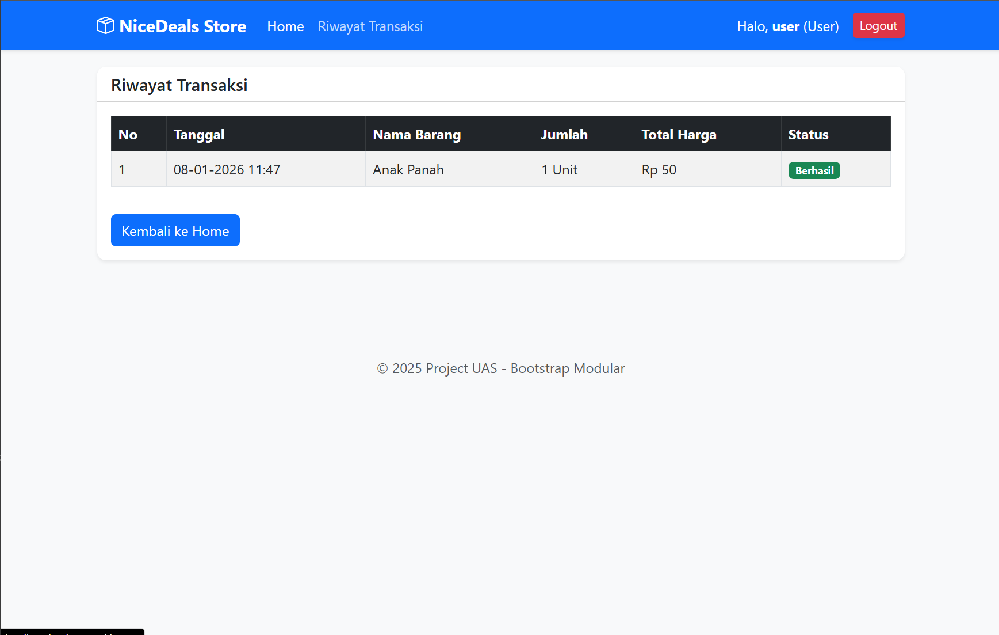
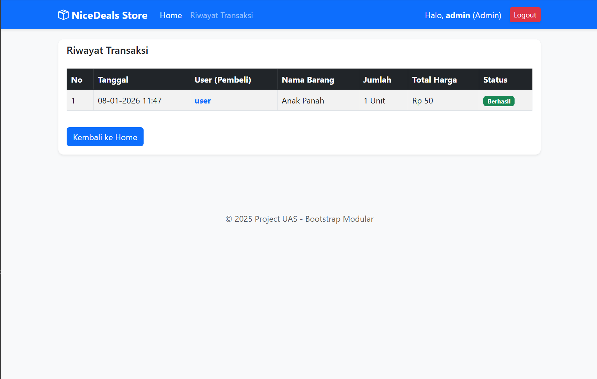

# UASWEB

- Nama : Roufan Awaluna Romadhon
- NIM : 312410423
- Kelas : TI.24.A.3

---

## Deskripsi

Disini saya membuat sebuah Membuat Aplikasi Sederhana inventaris barang dengan menggunakan PHP dan SQL untuk database. tugas ini bertujuan untuk penilaian ujian akhir semester.

## Tugas Utama

- Berdasarkan project praktikum OOP dan Modular menggunakan Routing App (gunakan .htaccess).
- Desain tampilan responsive (mobile first) menggunakan Framework CSS Twitter Bootstrap.
- Lengkap dengan sistem login dengan role admin dan user.
- Semua fungsi berjalan: CRUD, Filter Pencaraian, dan Pagination

### Struktur Folder
```
UASWEB/
├── index.php
├── .htaccess
├── config/
│   └── database.php
├── models/
│   └── barang.php
│   └── transaksi.php
└── views/
    └── beli.php
    └── edit.php
    └── footer.php
    └── header.php
    └── home.php
    └── login.php
    └── riwayat.php
    └── tambah.php
```

ada 1 admin dan 1 user yaitu:
- user: user123
- admin: admin123

### Petunjuk Singkat

1. URL Webnya, maka muncul tampilan Login.



2. Setelah itu Login dengan akun diatas dan diarahkan ke halaman dashboard.

Tetapi karena akun ada role user dan admin, makan ada perbedaan dimana user membeli barang dan admin  menambah, mengedit dan menghapus barang.

- Role User



- Role Admin



3. Untuk user jika pencet tombol beli maka muncul tampilan beli seperti ini.



4. Untuk admin berikut tampilan tambah, edit dan hapus.

- Tambah



- Edit



- Hapus



5. Untuk History transaksi ada perbedaan di rolenya pada admin terdapat tambahan nama siapa yang membeli produk tersebut.

- User



- Admin



### Penjelasan Singkat dan Demo Video


### Link URL Web